 

## GitHub Activity

## About Me

I am Renato Azevedo Caldas, a 21-year-old Systems Analyst intern in Rio de Janeiro focused on building enterprise software that improves operations through cloud, automation, backend development, and systems integration.

I study Computer Science at Veiga de Almeida University, with graduation expected in 2027, and I enjoy turning business requirements into reliable technical solutions for internal teams and production environments.

<table width="100%" style="width:100%; border-collapse:collapse;">
  <tr>
    <td><strong>Location</strong></td>
    <td>Rio de Janeiro, Brazil</td>
  </tr>
  <tr>
    <td><strong>Role</strong></td>
    <td>Systems Analyst Intern at Ramada Atacadista</td>
  </tr>
  <tr>
    <td><strong>Focus</strong></td>
    <td>Cloud Computing, Software Engineering, Automation, Databases, Platform Engineering</td>
  </tr>
  <tr>
    <td><strong>Education</strong></td>
    <td>Bachelor's Degree in Computer Science, Veiga de Almeida University, expected 2027</td>
  </tr>
</table>

## Tech Stack

### Languages

### Backend

### Cloud

### Databases

### Automation

### DevOps

### Enterprise

### Analytics

### Infrastructure

### Tools

### Devicon Strip

  
  
  
  
  
  
  
  
  
  
  

## Current Focus

<table>
  <tr>
    <td><strong>AWS Solutions Architect</strong></td>
    <td>Cloud fundamentals, architecture design, and production-ready delivery patterns.</td>
  </tr>
  <tr>
    <td><strong>Docker and Kubernetes</strong></td>
    <td>Containerization, orchestration, and deployment workflows.</td>
  </tr>
  <tr>
    <td><strong>Terraform and CI/CD</strong></td>
    <td>Infrastructure as code, automation, and repeatable delivery pipelines.</td>
  </tr>
  <tr>
    <td><strong>Microservices and Clean Architecture</strong></td>
    <td>System boundaries, maintainability, and domain-driven design thinking.</td>
  </tr>
  <tr>
    <td><strong>AI and LLMs</strong></td>
    <td>Practical application of AI to automation, analysis, and productivity.</td>
  </tr>
</table>

## Professional Experience

### Systems Analyst Intern, Ramada Atacadista
*Jun 2026 - Present | Rio de Janeiro, RJ, Brazil | On-site*

- Developed and implemented improvements in internal systems, website features, mobile applications, n8n workflows, and Sankhya ERP, helping automate processes and improve operational efficiency and user experience.
- Performed Oracle and AWS database analysis, identifying table inconsistencies and API integration issues, while supporting fixes in production environments.
- Provided technical support through GLPI, resolving tickets related to software, hardware, printers, equipment maintenance, and end-user support.
- Executed installation, configuration, maintenance, and replacement of IT equipment, including UPS units, computers, and peripherals.
- Participated in planning meetings, sprints, and Scrum ceremonies, collaborating with development teams on improvements, requirements gathering, and problem solving.

### Administrative Assistant, Multiplan Empreendimentos S.A.
*Sep 2023 - Aug 2025 | Rio de Janeiro, Brazil | On-site*

- Supported administrative and operational teams through document control and internal service requests.
- Managed end-to-end request registration and tracking in SAP GUI, ensuring process compliance and traceability.
- Analyzed and maintained Excel spreadsheets, creating automations that reduced manual work and increased team productivity by approximately 50%.
- Worked across administrative workflows for BarraShopping and New York City Center, supporting business operations with accuracy and organization.

## Education

<table width="100%" style="width:100%; border-collapse:collapse;">
  <tr>
    <td><strong>Institution</strong></td>
    <td><strong>Program</strong></td>
    <td><strong>Status</strong></td>
  </tr>
  <tr>
    <td>Veiga de Almeida University</td>
    <td>Bachelor's Degree in Computer Science</td>
    <td>Expected 2027</td>
  </tr>
</table>

## Certifications

<table width="100%" style="width:100%; border-collapse:collapse;">
  <tr>
    <td><strong>Certification</strong></td>
    <td><strong>Area</strong></td>
  </tr>
  <tr>
    <td>Power BI Complete</td>
    <td>Analytics</td>
  </tr>
  <tr>
    <td>Power BI Data Modeling</td>
    <td>Analytics</td>
  </tr>
  <tr>
    <td>Python</td>
    <td>Programming</td>
  </tr>
  <tr>
    <td>Programming Logic</td>
    <td>Fundamentals</td>
  </tr>
  <tr>
    <td>C Programming</td>
    <td>Programming</td>
  </tr>
  <tr>
    <td>TOEFL Junior Gold</td>
    <td>English</td>
  </tr>
  <tr>
    <td>BRASAS English</td>
    <td>English</td>
  </tr>
</table>

## Featured Projects

<table width="100%" style="width:100%; border-collapse:collapse;">
  <tr>
    <td width="50%" valign="top">
      <h3 align="center" style="margin:0 0 8px 0;"><a href="https://github.com/rencaldas/seslock-holmes" target="_blank" rel="external noopener noreferrer">seslock-holmes</a></h3>
      
Dashboard to investigate Amazon SES events, centralize logs, bounces, complaints, and delivery metrics, and speed up troubleshooting.

      
<strong>TypeScript | AWS SES | Dashboard | Diagnostics</strong>

    </td>
    <td width="50%" valign="top">
      <h3 align="center" style="margin:0 0 8px 0;"><a href="https://github.com/rencaldas/projeto-alfredos" target="_blank" rel="external noopener noreferrer">projeto-alfredos</a></h3>
      
Self-hosted automation ecosystem that integrates RSS feeds and APIs with Telegram Bot API workflows through n8n and Docker.

      
<strong>n8n | Docker | JavaScript | API Integration | Automation</strong>

    </td>
  </tr>
  <tr>
    <td width="50%" valign="top">
      <h3 align="center" style="margin:0 0 8px 0;"><a href="https://github.com/rencaldas/projeto_extensao_vi" target="_blank" rel="external noopener noreferrer">projeto_extensao_vi</a></h3>
      
Academic 32-bit block cipher built as a substitution-permutation network in pure Python for systems security and cryptography studies.

      
<strong>Python | Cryptography | Security | Algorithms</strong>

    </td>
    <td width="50%" valign="top">
      <h3 align="center" style="margin:0 0 8px 0;"><a href="https://github.com/rencaldas/simulador_filas_estocasticas" target="_blank" rel="external noopener noreferrer">simulador_filas_estocasticas</a></h3>
      
Discrete-event queue simulator for modeling service systems and analyzing performance with stochastic processes.

      
<strong>Python | Simulation | Queueing Theory | Performance Analysis</strong>

    </td>
  </tr>
</table>

## Quote

## Visitor Counter

---

<strong>Let's build enterprise software that makes operations simpler, faster, and more intelligent.</strong>

 
 

 | [GitHub](https://github.com/rencaldas) | [Email](mailto:YOUR_EMAIL@example.com) | [Portfolio](https://your-portfolio.example.com)

[github]: https://github.com/rencaldas
[email]: mailto:YOUR_EMAIL@example.com
[portfolio]: https://your-portfolio.example.com
