<!--
Update these placeholders once:
- YOUR_GITHUB_USERNAME
- LinkedIn / email / portfolio / blog links

The rest of the profile is wired to work out of the box.
-->

 

 

## About Me

I am Renato Azevedo Caldas, a Systems Analyst intern in Rio de Janeiro focused on building enterprise software that improves operations through cloud, automation, backend development, and systems integration.

I study Computer Science at Veiga de Almeida University, with graduation expected in 2027, and I enjoy turning business requirements into reliable technical solutions for internal teams and production environments.

<table>
  <tr>
    <td><strong>Location</strong></td>
    <td>Rio de Janeiro, Brazil</td>
  </tr>
  <tr>
    <td><strong>Role</strong></td>
    <td>Systems Analyst Intern at Ramada Atacadista</td>
  </tr>
  <tr>
    <td><strong>Focus</strong></td>
    <td>Cloud Computing, Software Engineering, Automation, Databases, Platform Engineering</td>
  </tr>
  <tr>
    <td><strong>Education</strong></td>
    <td>Bachelor's Degree in Computer Science, Veiga de Almeida University, expected 2027</td>
  </tr>
</table>

## Tech Stack

### Languages

### Backend

### Cloud

### Databases

### Automation

### DevOps

### Enterprise

### Analytics

### Infrastructure

### Tools

### Devicon Strip

  
  
  
  
  
  
  
  
  
  
  

## Current Focus

<table>
  <tr>
    <td><strong>AWS Solutions Architect</strong></td>
    <td>Cloud fundamentals, architecture design, and production-ready delivery patterns.</td>
  </tr>
  <tr>
    <td><strong>Docker and Kubernetes</strong></td>
    <td>Containerization, orchestration, and deployment workflows.</td>
  </tr>
  <tr>
    <td><strong>Terraform and CI/CD</strong></td>
    <td>Infrastructure as code, automation, and repeatable delivery pipelines.</td>
  </tr>
  <tr>
    <td><strong>Microservices and Clean Architecture</strong></td>
    <td>System boundaries, maintainability, and domain-driven design thinking.</td>
  </tr>
  <tr>
    <td><strong>AI and LLMs</strong></td>
    <td>Practical application of AI to automation, analysis, and productivity.</td>
  </tr>
</table>

## Professional Experience

### Systems Analyst Intern, Ramada Atacadista

- Enterprise systems analysis with a focus on business enablement, reliability, and process improvement.
- Internal web applications and mobile applications supporting operational workflows.
- n8n automations, REST APIs, and database analysis for better data flow and integration.
- Oracle, AWS, ERP Sankhya, ERP SAP, and Power BI support aligned with business needs.
- SCRUM participation, requirements analysis, technical documentation, SQL, and production support.
- Infrastructure awareness across hardware, networking, and operational continuity.

### Engineering Mindset

- I translate business problems into technical solutions instead of treating systems work as simple support.
- I prioritize automation, observability, data quality, and maintainable integrations.
- I work across application, data, and infrastructure layers to support enterprise operations.

## Education

| Institution | Program | Status |
| --- | --- | --- |
| Veiga de Almeida University | Bachelor's Degree in Computer Science | Expected 2027 |

## Certifications

| Certification | Area |
| --- | --- |
| Power BI Complete | Analytics |
| Power BI Data Modeling | Analytics |
| Python | Programming |
| Programming Logic | Fundamentals |
| C Programming | Programming |
| TOEFL Junior Gold | English |
| BRASAS English | English |

## Featured Projects

<table>
  <tr>
    <td width="50%" valign="top">
      <h3 align="center">Email Investigation Dashboard</h3>
      
Operational dashboard for triage, investigation, and visibility.

      
<strong>Power BI | SQL | Automation</strong>

    </td>
    <td width="50%" valign="top">
      <h3 align="center">Internal Automation Platform</h3>
      
Reusable workflows that remove manual work from daily operations.

      
<strong>n8n | REST APIs | Webhooks</strong>

    </td>
  </tr>
  <tr>
    <td width="50%" valign="top">
      <h3 align="center">Enterprise Integrations</h3>
      
Connectors and services for ERP, databases, and internal systems.

      
<strong>Python | SQL | AWS | Oracle</strong>

    </td>
    <td width="50%" valign="top">
      <h3 align="center">Cloud Labs</h3>
      
Practical experiments in cloud architecture, deployment, and security.

      
<strong>AWS | Docker | Terraform</strong>

    </td>
  </tr>
  <tr>
    <td width="50%" valign="top">
      <h3 align="center">Docker Labs</h3>
      
Containerized services and deployment-ready environments.

      
<strong>Docker | Linux | GitHub Actions</strong>

    </td>
    <td width="50%" valign="top">
      <h3 align="center">Future Open Source Projects</h3>
      
Public tools and utilities built with a systems engineering mindset.

      
<strong>Backend | Automation | Platform</strong>

    </td>
  </tr>
</table>

## GitHub Statistics

 
 

 
 

 
 

## Contribution Graph

## Snake Animation

## Quote

## Visitor Counter

---

<strong>Let's build enterprise software that makes operations simpler, faster, and more intelligent.</strong>

 
 

[LinkedIn](https://www.linkedin.com/in/rcaldas/) | [GitHub](https://github.com/YOUR_GITHUB_USERNAME) | [Email](mailto:YOUR_EMAIL@example.com) | [Portfolio](https://your-portfolio.example.com) | [Blog](https://your-blog.example.com)

[linkedin]: https://www.linkedin.com/in/rcaldas/
[github]: https://github.com/YOUR_GITHUB_USERNAME
[email]: mailto:YOUR_EMAIL@example.com
[portfolio]: https://your-portfolio.example.com
[blog]: https://your-blog.example.com
