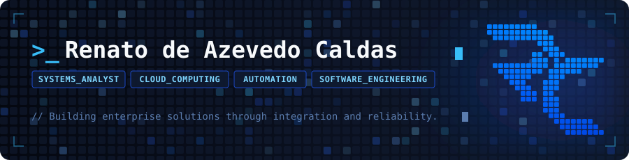

 

<picture>
  <source media="(prefers-color-scheme: dark)" srcset="https://raw.githubusercontent.com/rencaldas/rencaldas/output/github-contribution-grid-snake-dark.svg" />
  <source media="(prefers-color-scheme: light)" srcset="https://raw.githubusercontent.com/rencaldas/rencaldas/output/github-contribution-grid-snake.svg" />
  
</picture>

## About Me

I am Renato de Azevedo Caldas, a 21-year-old Systems Analyst intern in Rio de Janeiro focused on building enterprise software that improves operations through cloud, automation, backend development, and systems integration.

I study Computer Science at Veiga de Almeida University, with graduation expected in 2027, and I enjoy turning business requirements into reliable technical solutions for internal teams and production environments.

## 🚀 Featured Projects
| Project | Description | Stack |
| :--- | :--- | :--- |
| **[Seslock Holmes](https://github.com/rencaldas/seslock-holmes)** | Read-only dashboard for investigating Amazon SES email events via Supabase/PostgreSQL. Used to diagnose delivery failures and reduced the production bounce rate by up to 93% |      |
| **[Projeto Alfredos](https://github.com/rencaldas/projeto-alfredos)** | Automations (Telegram + email) for tech news, free games, dependency vulnerability alerts, and a daily executive report generated with Google Gemini |   |
| **[Portfolio](https://github.com/rencaldas/rencaldas.github.io)** | Personal professional portfolio featuring career history, tech stack, experiences, and featured projects |     |

## 🛠️ Tech Stack

| Category | Technology & Tools |
| :--- | :--- |
| **Programming & Web Development** |       |
| **Cloud Computing** |         |
| **Databases** |       |
| **Automation & Integration** |     |
| **Containers & DevOps** |    |
| **Enterprise Systems** |   |
| **Data Analysis** |   |
| **Infrastructure** |     |
| **UX/UI Design** |   |
| **Methodologies** |   |

---

[github]: https://github.com/rencaldas
[email]: mailto:renato.deacaldas@gmail.com
[portfolio]: https://rencaldas.github.io/
